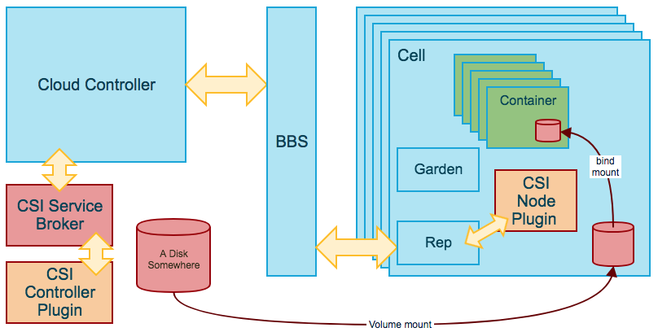

# Container Storage Interface (CSI) Volume Plugin Support in Cloud Foundry

CSI provides a uniform storage plugin interface that allows storage providers to implement plugins that will connect their storage to multiple container orchestrators (Kubernetes, Mesos, and Cloud Foundry as of this writing).

## Version Support
Currently, Cloud Foundry supports [CSI version 0.3](https://github.com/container-storage-interface/spec/tree/v0.3.0)

## Limitations
There are a number of notable limitations in Cloud Foundry's CSI support:
* Plugins Advertising `ACCESSIBILITY_CONSTRAINTS` from `GetPluginCapabilities` will be rejected, since we do not have logic to respect topology constraints in Cloud Foundry.
* Plugins Advertising `PUBLISH_UNPUBLISH_VOLUME` from `ControllerGetCapabilities` will likely fail.  Cloud Foundry does not currently make calls to `ControllerPublishVolume` even when the plugin implements it.
* Current Cloud Foundry service broker implementations don't have support for snapshot creation, so even for plugins advertising `CREATE_DELETE_SNAPSHOT` we don't support snapshots.  Adding snapshot support to [csibroker](https://github.com/cloudfoundry/csibroker) is theoretically not difficult however.
* Cloud Foundry container scheduling emphasizes high availability and does not allow us to guarantee that container instances are not running simultaneously on different nodes.  For this reason, it is not recommended to use CSI plugins with block storage, or with single-access modes (`SINGLE_NODE_WRITER`, `SINGLE_NODE_READER_ONLY` or `MULTI_NODE_SINGLE_WRITER`).

## Overview
CSI plugins typically support 2 plugin components:
* The **Controller Plugin** can be running anywhere, and is concerned with provisioning storage and attaching it to particular nodes.
* The **Node Plugin** must be colocated on the same VM as workloads using the storage, and is concerned with node specific tasks such as mounting/unmounting the storage, or iSCSI initiation.  For Cloud Foundry purposes a **CSI Node** is equivalent to a **Diego Cell**.

Some plugins consolidate both components into a single binary, in which case, we might have to route controller traffic to a particular node, but to keep this document simple, we will assume that there are 2 separate components for now.

If you're familar [with the support for volume services in Cloud Foundry](http://bit.ly/cf-persi-overview) prior to the advent of CSI, then you might have noticed that:

1) the functions of a CSI controller plugin are very similar to a Cloud Foundry volume service broker, and
1) the functions of a CSI node plugin are very similar to a Cloud Foundry/Docker volume plugin.

It should come as no suprise, then, that the CSI integration for Cloud Foundry bears a close resemblance to existing Volume Service integrations:

### Components of the Cloud Foundry CSI Integration

* [csibroker](https://github.com/cloudfoundry/csibroker) is a generic Open Service Broker API (OSBAPI) service broker that translates OSBAPI service instances and service bindings into calls to the CSI controller plugin.  For folks familiar with the kubernetes CSI integration, csibroker fulfills a similar function to the k8s [external-provisioner](https://github.com/kubernetes-csi/external-provisioner) container. csibroker must be configured with 
  - connection information that tells it where to find the CSI Controller plugin 
  - a service catalog that maps human readable service and plan offerings into CSI ControllerCreateVolume data payloads (TBD in the current csibroker)
  It is not strictly necessary to use csibroker as-is, but we hope to make it generic enough to bridge the gap between the OSBAPI and the CSI Controller interface.  If you find areas that require enhancement to meet your needs, please let us know in a [github issue](https://github.com/cloudfoundry/csi-plugins-release/issues)

## Deployment Considerations

### Basic Deployment

### Deployment of Containerized Plugins

## More Resources
